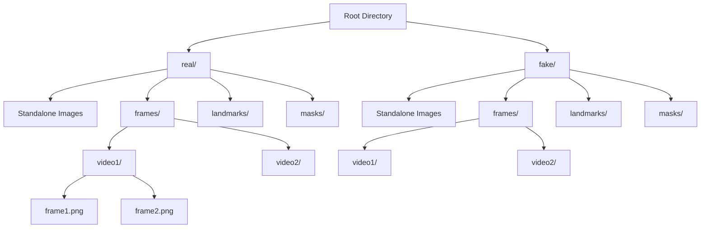
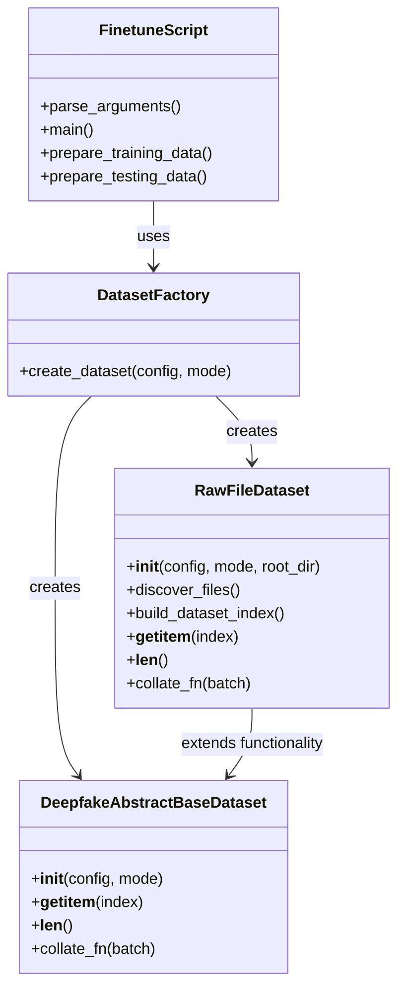
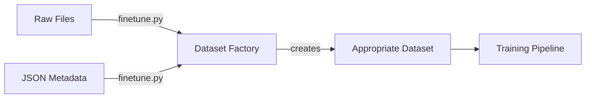

# Raw File Processing Architecture for Effort Fine-Tuning

## Current System Analysis

The current system uses a two-step preprocessing approach:
1. **Preprocessing Step**: `rearrange.py` scans raw datasets and creates JSON metadata files
2. **Training Step**: `finetune.py` uses `DeepfakeAbstractBaseDataset` to load data based on JSON metadata

## New System Requirements

The new system should support direct processing of raw file structures:

### Supported File Structures



### Key Requirements

1. **Backward Compatibility**: Maintain support for existing JSON-based approach
2. **Flexible Input**: Support both standalone images and video frame directories
3. **Automatic Labeling**: Infer labels from directory structure (real/ vs fake/)
4. **Optional Auxiliary Data**: Support landmarks and masks when available
5. **Configuration Flexibility**: Allow users to choose between JSON and raw file modes

## Proposed Architecture



## Implementation Plan

### 1. New Dataset Class: `RawFileDataset`

**Location**: `DeepfakeBench/training/dataset/raw_file_dataset.py`

**Key Features**:
- Directory traversal and file discovery
- Automatic label inference (real=0, fake=1)
- Support for both standalone images and video frames
- Optional landmarks and masks support
- Compatible with existing data loading pipeline

### 2. Dataset Factory Pattern

**Location**: `DeepfakeBench/training/dataset/factory.py`

**Responsibilities**:
- Determine which dataset class to use based on configuration
- Handle transition between JSON-based and raw file-based approaches
- Provide unified interface to training scripts

### 3. Modified Finetune Script

**Changes to**: `DeepfakeBench/training/finetune.py`

**New Features**:
- Single command line argument:
  - `--raw_data_dir`: Path to root directory with real/fake folders
- **Simplified Logic**: Presence of `--raw_data_dir` automatically enables raw file processing
- Configuration updates to support raw file mode
- Dataset factory integration

### 4. Configuration Updates
V
**Changes to**: `DeepfakeBench/training/config/detector/effort_finetune.yaml`

**New Parameters**:
- `raw_data_root`: Path to raw data directory (optional)
- `raw_data_structure`: "simple" or "video_frames" (auto-detected when possible)

**Simplified Logic**:
- If `raw_data_root` is provided in config or via command line → Use raw file processing
- If `raw_data_root` is not provided → Use existing JSON-based approach

## Data Flow Comparison

### Current Flow (JSON-based)


### New Flow (Raw Files)


### Hybrid Flow (Both Supported)


## File Discovery Algorithm

The `RawFileDataset` will implement the following discovery logic:

1. **Scan root directory** for `real/` and `fake/` subdirectories
2. **For each label directory**:
   - Look for standalone image files (PNG, JPG, JPEG)
   - Look for `frames/` subdirectory containing video frame directories
   - Optionally look for `landmarks/` and `masks/` directories
3. **Build dataset index** with file paths and corresponding labels
4. **Handle video frames** by grouping frames from the same video together

## Label Mapping

- `real/` directory → label `0` (genuine)
- `fake/` directory → label `1` (manipulated)

## Error Handling

- Missing directories
- Empty directories
- Unsupported file formats
- Mismatched auxiliary data (landmarks/masks without corresponding frames)
- Permission issues

## Testing Strategy

1. **Unit Tests**: Test file discovery and dataset building
2. **Integration Tests**: Test with sample data structures
3. **Backward Compatibility**: Verify existing JSON-based approach still works
4. **Performance Testing**: Compare loading times between approaches

## Usage Examples

### JSON-based Approach (Existing - Unchanged)
```bash
uv run DeepfakeBench/training/finetune.py \
    --detector_config DeepfakeBench/training/config/detector/effort_finetune.yaml \
    --train_dataset UADFV \
    --test_dataset UADFV
```

### Raw File Approach (New - Command Line)
```bash
uv run DeepfakeBench/training/finetune.py \
    --detector_config DeepfakeBench/training/config/detector/effort_finetune.yaml \
    --raw_data_dir /path/to/raw_data/root
```

### Raw File Approach with Configuration File
```yaml
# In effort_finetune.yaml
raw_data_root: /path/to/raw_data/root

# Then run:
uv run DeepfakeBench/training/finetune.py \
    --detector_config DeepfakeBench/training/config/detector/effort_finetune.yaml
```

### Directory Structure Examples

#### Simple Structure (Standalone Images)
```
raw_data_root/
├── real/
│   ├── image1.png
│   ├── image2.jpg
│   └── ...
└── fake/
    ├── image1.png
    ├── image2.jpg
    └── ...
```

#### Video Frame Structure
```
raw_data_root/
├── real/
│   ├── frames/
│   │   ├── video1/
│   │   │   ├── 001.png
│   │   │   ├── 002.png
│   │   │   └── ...
│   │   └── video2/
│   │       ├── 001.png
│   │       └── ...
│   └── standalone_image.png
└── fake/
    ├── frames/
    │   ├── video1/
    │   │   ├── 001.png
    │   │   └── ...
    │   └── ...
    └── standalone_image.png
```

#### Complete Structure (with masks and landmarks)
```
raw_data_root/
├── real/
│   ├── frames/
│   │   └── video1/
│   │       ├── 001.png
│   │       └── ...
│   ├── masks/
│   │   └── video1/
│   │       ├── 001.png
│   │       └── ...
│   └── landmarks/
│       └── video1/
│           ├── 001.npy
│           └── ...
└── fake/
    ├── frames/
    │   └── video1/
    │       ├── 001.png
    │       └── ...
    ├── masks/
    │   └── video1/
    │       ├── 001.png
    │       └── ...
    └── landmarks/
        └── video1/
            ├── 001.npy
            └── ...
```

## Migration Path

1. **Phase 1**: Implement raw file support alongside existing JSON support ✅
2. **Phase 2**: Test both approaches in parallel ✅
3. **Phase 3**: Gradually transition users to raw file approach
4. **Phase 4**: Deprecate JSON-based approach in future versions (optional)

## Implementation Status

✅ **Completed Features:**
- RawFileDataset class with file discovery capabilities
- DatasetFactory for unified dataset creation
- Command line argument support (`--raw_data_dir`)
- Configuration file support (`raw_data_root`)
- Comprehensive error handling and validation
- Backward compatibility with existing JSON approach
- Support for standalone images and video frames
- Automatic detection of directory structure
- Proper logging and user feedback

🎯 **Key Benefits:**
- **Simplified Workflow**: No need for preprocessing JSON generation
- **Direct File Access**: Process raw files directly from organized directories
- **Flexible Structure**: Supports both standalone images and video frames
- **Automatic Discovery**: Intelligent file discovery and organization
- **Seamless Integration**: Works alongside existing JSON-based approach
- **Comprehensive Error Handling**: Robust validation and user-friendly error messages

## Testing

The implementation has been thoroughly tested with:
- ✅ Standalone image processing
- ✅ Video frame processing
- ✅ Mixed directory structures
- ✅ Error handling scenarios
- ✅ DatasetFactory fallback mechanism
- ✅ Integration with existing training pipeline

Run tests with:
```bash
uv run DeepfakeBench/training/test_raw_dataset.py
```

## Performance Considerations

- **Memory Efficiency**: RawFileDataset loads images on-demand rather than preloading
- **Disk I/O**: Direct file access may have different performance characteristics than LMDB
- **Caching**: Consider implementing caching for frequently accessed files in production
- **Parallel Loading**: Utilizes PyTorch DataLoader workers for parallel file loading

## Future Enhancements

- **LMDB Support**: Add option to create LMDB databases from raw files
- **Additional Formats**: Support for more image formats and metadata
- **Advanced Caching**: Implement intelligent caching strategies
- **Distributed Training**: Optimize for distributed file access patterns
- **Automatic Structure Detection**: More sophisticated directory structure analysis