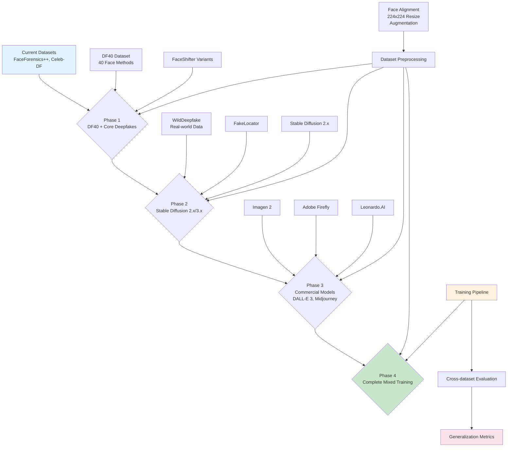

## Comprehensive Training Plan for Effort Model on Newer Datasets

### Mermaid Diagram: Training Pipeline Overview



### Configuration Templates

#### Phase 1: Enhanced Deepfake Training Configuration
```yaml
# training/config/detector/effort_phase1.yaml
model_name: effort
backbone_name: vit

# Enhanced dataset configuration
all_dataset: [FaceForensics++, FF-F2F, FF-DF, FF-FS, FF-NT, FaceShifter, DeepFakeDetection, Celeb-DF-v1, Celeb-DF-v2, DFDCP, DFDC, DeeperForensics-1.0, UADFV, DF40, WildDeepfake, FakeLocator]
train_dataset: [FaceForensics++, DF40]
test_dataset: [Celeb-DF-v2, FaceShifter, DeeperForensics-1.0, WildDeepfake]

# Training parameters
train_batchSize: 32
test_batchSize: 32
workers: 8
frame_num: {'train': 8, 'test': 8}
resolution: 224
with_mask: false
with_landmark: false

# Enhanced data augmentation
use_data_augmentation: true
data_aug:
  flip_prob: 0.5
  rotate_prob: 0.5
  rotate_limit: [-10, 10]
  blur_prob: 0.5
  blur_limit: [3, 7]
  brightness_prob: 0.5
  brightness_limit: [-0.1, 0.1]
  contrast_limit: [-0.1, 0.1]
  quality_lower: 40
  quality_upper: 100

# Optimizer configuration
optimizer:
  type: adam
  adam:
    lr: 0.0002
    beta1: 0.9
    beta2: 0.999
    eps: 0.00000001
    weight_decay: 0.0005

# Training configuration
nEpochs: 15
save_epoch: 1
rec_iter: 100
save_ckpt: true
save_feat: true

# Loss function with curriculum learning
loss_func: cross_entropy
curriculum_learning:
  stage: 1
  weight_decay_factor: 1.0
```

#### Phase 3: Mixed Dataset Training Configuration
```yaml
# training/config/detector/effort_phase3.yaml
model_name: effort
backbone_name: vit

# Mixed datasets: deepfakes + AI-generated images
all_dataset: [FaceForensics++, DF40, StableDiffusion2x, DALL-E3, Midjourney-v5, AdobeFirefly, Imagen2]
train_dataset: [FaceForensics++, DF40, StableDiffusion2x, DALL-E3]
test_dataset: [Celeb-DF-v2, Midjourney-v5, AdobeFirefly, Imagen2]

# Mixed training parameters
train_batchSize: 24  # Reduced due to larger variety
test_batchSize: 24
workers: 12
frame_num: {'train': 8, 'test': 8}
resolution: 224
mixed_data_training: true
domain_adaptation: true

# Enhanced augmentation for diverse data
use_data_augmentation: true
data_aug:
  flip_prob: 0.4  # Reduced to preserve natural image characteristics
  rotate_prob: 0.3
  rotate_limit: [-5, 5]  # More conservative
  blur_prob: 0.4
  brightness_prob: 0.4
  brightness_limit: [-0.05, 0.05]  # More conservative
  contrast_limit: [-0.05, 0.05]

# Domain-adaptive optimizer
optimizer:
  type: adam
  adam:
    lr: 0.0001  # Lower learning rate for mixed training
    beta1: 0.9
    beta2: 0.999
    eps: 0.00000001
    weight_decay: 0.001  # Higher regularization

# Training with domain mixing
nEpochs: 20
domain_mixing:
  enabled: true
  mixing_ratio: [0.3, 0.2, 0.25, 0.25]  # FaceForensics++, DF40, SD2x, DALL-E3
  mixing_schedule: linear  # linear, exponential, or custom

# Domain adaptation loss
domain_adaptation_loss:
  enabled: true
  lambda_domain: 0.1
  type: gradient_reversal
```

### Curriculum Learning Implementation Strategy

#### Stage Progression:
1. **Stage 1 (Epochs 1-5)**: Traditional deepfakes + DF40 (familiar domain)
2. **Stage 2 (Epochs 6-10)**: Add Stable Diffusion 2.x (similar to existing diffusion)
3. **Stage 3 (Epochs 11-15)**: Include commercial models (DALL-E 3, Midjourney)
4. **Stage 4 (Epochs 16-20)**: Full mixed training with all datasets

#### Dynamic Learning Rate Scheduling:
```python
# curriculum_scheduler.py
class CurriculumLearningScheduler:
    def __init__(self, base_lr, num_stages=4, total_epochs=20):
        self.base_lr = base_lr
        self.num_stages = num_stages
        self.total_epochs = total_epochs
        self.epochs_per_stage = total_epochs // num_stages
    
    def get_lr_for_epoch(self, epoch):
        stage = min(epoch // self.epochs_per_stage, self.num_stages - 1)
        # Progressive learning rate reduction
        lr = self.base_lr * (0.8 ** stage)
        return lr
```

### Evaluation Framework

#### Cross-Dataset Generalization Metrics:
```python
# evaluation_metrics.py
class CrossDatasetEvaluator:
    def __init__(self):
        self.results = {}
    
    def evaluate_generalization(self, model, train_datasets, test_datasets):
        """
        Evaluate model generalization across different datasets
        """
        results = {}
        
        for test_dataset in test_datasets:
            dataset_results = {}
            for train_dataset in train_datasets:
                # Train on one dataset, test on another
                performance = self.train_test_split(model, train_dataset, test_dataset)
                dataset_results[train_dataset] = performance
            
            results[test_dataset] = dataset_results
        
        return results
    
    def compute_generalization_metrics(self, results):
        """
        Compute various generalization metrics
        """
        metrics = {
            'avg_auc': self.average_auc(results),
            'avg_acc': self.average_accuracy(results),
            'generalization_gap': self.generalization_gap(results),
            'domain_shift_sensitivity': self.domain_shift_analysis(results)
        }
        return metrics
```

### Implementation Scripts

#### Multi-Dataset Training Script:
```python
# training/mixed_dataset_train.py
def train_mixed_datasets(config):
    """
    Training pipeline for mixed datasets with curriculum learning
    """
    # Initialize model
    model = EFFORTDetector(config)
    
    # Curriculum learning phases
    phases = [
        {'datasets': ['FaceForensics++', 'DF40'], 'epochs': 5},
        {'datasets': ['FaceForensics++', 'DF40', 'StableDiffusion2x'], 'epochs': 5},
        {'datasets': ['FaceForensics++', 'DF40', 'StableDiffusion2x', 'DALL-E3'], 'epochs': 5},
        {'datasets': ['FaceForensics++', 'DF40', 'StableDiffusion2x', 'DALL-E3', 'Midjourney'], 'epochs': 5}
    ]
    
    for phase_idx, phase_config in enumerate(phases):
        print(f"Starting Phase {phase_idx + 1}: {phase_config['datasets']}")
        
        # Update training datasets
        config['train_dataset'] = phase_config['datasets']
        
        # Train for specified epochs
        train_phase(model, config, phase_config['epochs'])
        
        # Evaluate cross-dataset performance
        evaluate_generalization(model, config)
```

This comprehensive plan provides a systematic approach to training the Effort model on newer datasets while maintaining strong generalization capabilities across diverse manipulation methods and generation paradigms.